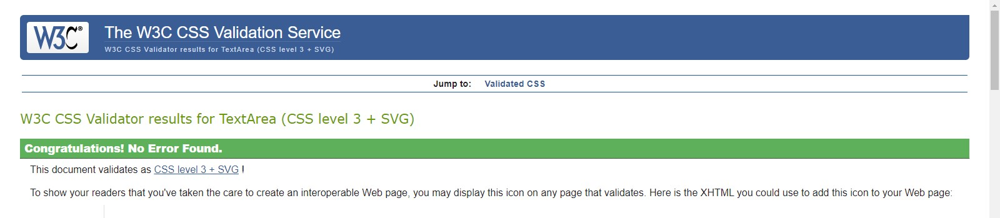
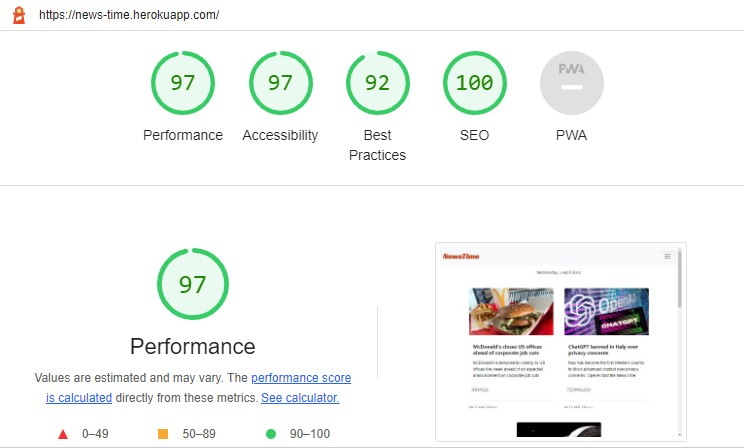

<h1 align="center">NewsTime</h1> 

NewsTime is for anyone who wants to stay informed and engaged with news from around the world and the latest news from various categories like Politics, Business, Art, Technology, Science, Economy.
NewsTime is responsible for the gathering and broadcasting of news and current affairs around the world.

## __User Experience (UX)__

### _User Stories_

* **As a Site Admin**

1. News Post Management: As a site Admin I can create, read, update and delete news posts in front-end so that I can manage news content easily.
2. View likes: As a Site Admin I can view the number of likes on each article so that I can see which type of news the audience prefers the most.
3. As a Site Admin I can view comments on an individual articles so that I can read the conversation.
4. Approve comments: As a Site Admin I can approve or delete comments so that I can filter out obnoxious comments.

* **As a Site User**

1. View News List: As a Site User I can view a list of news so that I can select one news to read.
2. View Comments: As a Site User I can view comments on an individual articles so that I can read the conversation.
3. Account Registration: As a Site User I can register an account so that I can comment and like.
4. News Category: As a Site User I can receive news from various category on the page so that I can be informed news from various category.
5. Open News Posts: As a Site User I can click on a post so that I can read the full article.
6. Site Pagination: As a Site User I can view a paginated list of news so that select a news post I want to view.
7. Comment on News Posts: As a Site User I can leave comments on a article so that I can share my thoughts about an article.
8. Like/Unlike: As a Site User I can like or unlike an article so that I can interact with the content.
8. Number of Likes: Number of As a Site User I can view the number of likes on each article so that I can see which type of news the audience prefers the.

### _Design_

* **Colors** 

    * #cf4b1f - Logo, Buttons
    * #db0000 - Warning Text
    * tertiary - Navbar Background

* **Fonts**

    * Racing Sans One 

### _Wireframes_

I created Wireframes to visualize the site's design and act as a template to use when developing the site.

**Home Page**

**Article Page**

**Sign up page Page**

**Sign In page Page**

**Note:** explantion 

### _ERD (Entity Relationship Diagram)_

**Article/ News Post Data Model**

**User Comments Data Model**

**News Categories Data Model**

**User Data Model**

Note: I created a user data model and used the Django user model as well. I'll use my custom user model for future implementations.

## __Features__

### _Existing Features_

* **Navigation Bar**

    The full responsive navigation bar is featured on all the pages to allow for easy navigation from page to page across all devices. Access is distinct between admins and standard users, with restricted access to standard users.
    On the left side is logo, which can be used as navigation link to the main page, also links to the Home, Add News, Sign Up, SignIn, Sign Out.

    * Site Nav for Admins

        
    
    * Site Nav for First time visitor 

        

    * Site Nav for Standard User

        

    * Responsive Navbar Admin

        

    * Responsive Navbar Standard User

        

    The navigation bar was created with bootstrap and it's fully responsive across devices.

* **Home Page**

    The home page is the user's first call port and is composed of a list of news post. The feature here is the links to the news posts and its details like: news title, news overview, news category, published date, an eye-catching image of the news which draws the attention of users to open the links and read the article. All this detail makes it possible for users to find their favorite news topic in time.

    

* **Article Page**

    The users can read the detail about the news by clicking on the title of the news post.

    

* **Comments & Like**

    The Comments and Likes feature is restricted access to standard users. Users who are registered in NewsTime could leave a comment or Like an article.

    

* **Comment List**

    For those who aren't registered in Newstime, Can only read the comments on the article page.
    
    

* **Sign Up Page**

    

* **Sign In Page**

    

* **Sign Out page**

    

* **Footer**

    The footer section is consistent on all pages and includes links to the relevant social media sites and follows the same style as the navigation bar, and appears in the same format on all pages - this allows for consistency throughout the site.

    

    * The links will open in a separate tab in a browser to allow easy navigation for the users.
    * The footer is useful for users to get connected with the community for socialization through social networks.

* **Admin Home Page**

    The Admin page is only accessible for Admin users specifically. This page informs the superuser how to add, edit and delete news posts.

    

    * **Add Post - Admin page**

        The Add Song page is only accessible for Admin. This page consists of a form to be completed in order to add a news post, with title, news overview, news content input fields, featured image, news category and pulished status selector.
        The Add News Post form is fully responsive across all devices.

    
        

    * **Update/Edit News Post - Admin page**

        This page consists of a form with pre filled content. Update a news post form includes: title, news overview, news content input fields, featured image, news category and pulished status selector.
        The Update News Post form is fully responsive across all devices.

    

    * **Delete News Post - Admin page**

        The feature for this page is an eye-catching Warning text with exclamation font awesome icon, confirm buton and cancel button.

    

### _Future Implementations_

* Social Sharing Button
* Popular News Post Section
* User Profile
* Contact Form

## __Testing__

### HTML Validation 

### CSS Validation 
I used to validate every page of the project to ensure there were no CSS syntax errors in the project.

### JS Hint 
I used to validate the very minimal JavaScript in this project.

* I used onclick event to make a cancel button in the delete news post. I used JS Hint for validation as well. 

### Testing with Chrome DevTools Lighthouse

### CI Python Linter 
All code passed without errors, except settings.py and views.py which showed E501 'line too long' warnings.

* **CI Python Linter sittings.py** 

* **CI Python Linter views.py** 

* **CI Python Linter admin.py** 

* **CI Python Linter forms.py**

* **CI Python Linter models.py** 

* **CI Python Linter urls.py** 

* **CI Python Linter urls.py** 

## __Bugs__

1. **Sign Up Form is not organized:** To authenticate on my site, I used the allauth library. Because the allauth templates use `{form.as_p}` for registration by default. Unfortunately, the form appears irregular in this case. After much searching, I discovered that in order to make the form regular, I must add the `class:"form-contro"` bootstrap class. I followed the instructions, but the form remained in the same state. Later, with the advice of the tutor support, I used  `{form |crispy}` for the solution, and everything went as planned.

2. **summernote is not responsive:** To make summernote responsive on small devices, I added a few lines of code in the settings file and this method worked well.

3. I used the `col-md-10` class to center the news photo and the `offset-md-1` class to size the photo.

## __Technologies Used__

### **1. Languages**

* HTML5
* CSS3
* JavaScript
* Python

### **2. Frameworks, Libraries & Programs**

* **Django:** The Django web framework was used to create the full-stack web application.
* **PostgreSQL:** was used as the object-relational database system.
* **ElephantSQL:** ElephantSQL was used to host the database.
* **Bootstrap:** Bootstrap was used through the project to style the project and create responsive elements/layouts.
* **Git:** Git was used for version control by utilizing the Gitpod terminal to commit to Git and Push to GitHub.
* **GitHub:** GitHub is used to store the projects code after being pushed from Git.
* **Heroku:** Heroku was used for the deployed application.
* **Balsamiq:** Balsamiq was used to create the wireframes during the design process.
* **Chrome DevTools:** Chrome DevTools was used to consistently check the site in terms of responsivity,
 performance, accessibility, best practice and SEO.
* **Font Awesome:** Font Awesome was used on all pages throughout the website to add icons for UX purposes.
* **Font Awesome Favicon Generator** Font Awesome Favicon Generator was used to reproduce a favicon.

### **3. Python Modules and Packages**

* **cloudinary:** Used for the post Image Model field, Image upload and deletion.
* **django-crispy-forms:** Used to format form elements and layout.
* **crispy-bootstrap5:** Used to style form using Bootstrap5.
* **dj-database-url:** Allows the use of 'DATABASE_URL' environmental variable in the Django project settings file to 
 connect to a PostgreSQL database.
* **dj3-cloudinary-storage:** Facilitates integration with Cloudinary by implementing Django Storage API.
* **django-allauth:** Set of Django application used for account registration, management and authentication.
* **django-filter:** Application that allows dynamic QuerySet filtering from URL parameters.
* **django-model-utils:** Easily add choices to a django model field.
* **django-summernote:** Allows easy use of the Summernote WYSIWYG editor in Django projects.
* **gunicorn:** Python WSGI HTTP Server.
* **psycopg2:** Python PostgreSQL database adapter.

## __Deployment__

### **Create a Database**
These steps will create a PostgreSQL database:
1. Log in to ElephantSQL.com to access your dashboard
2. Click "Create New Instance"
3. Set up your plan
4. Select "Select Region"
5. Select a data center near you
6. Then click "Review"
7. Check your details are correct and then click "Create instance"
8. Return to the ElephantSQL dashboard and click on the database instance name for this project
9. In the URL section, click the copy icon to copy the database URL

### **Heroku**

Steps for deployment:
1. Click "New" and select "Create new app".
2. Input a meaningful name for your app and choose the region best suited to your location.
3. Select "Settings" from the tabs.
4. Add the config vars:
    * Database URL (your DB URL)
    * Secret Key (Example: Any secret-key)
    * Port (In my case is 8000)

5. Select "Deploy" from the tabs.
6. Link the Heroku app to the respository.
7. Select "GitHub - Connect to GitHub" from deployment methods.
8. Search for the GitHub repository by name.
9. Either click Enable Automatic Deploys for automatic deploys or Deploy Branch to deploy manually.
 Manually deployed branches will need re-deploying each time the repo is updated.
10. Click on Deploy.
11. Click View button to view the deployed site.

## __Credits__

1. I have to Acknowledgement that the Code Institute LMS, in particular the CI I Think Therefore I Blog Walkthrough 
was the main and big guide for me during devloping the site. I followed this project step by step and applied the steps in my project development journey.
2. Django Documentation
3. Stack Overflow
4. W3Schools

### _Codes_

1. The code for cancel button in delete news post template were taken from [SnakeyCode](https://snakeycode.wordpress.com/2016/08/25/add-a-cancel-button-to-django-delete-confirm-template/)
2. The code for making the summernote responsive were taken from [Slak Community](https://code-institute-room.slack.com/archives/C026PTF46F5/p1659130123716359?thread_ts=1659128142.218429&cid=C026PTF46F5)
3. The code for cards were taken from bootstrap
4. The code for displaying current day were taken from [W3Schools](https://www.w3schools.com/django/ref_tags_now.php)

### _Contents & Media_

1. All the news contnt and news image were taken from [BBC](https://www.bbc.com/news)

 
 ### _Acknowledgements_
 A big thanks to:

 1. [Our CI Tutor Support team:](https://learn.codeinstitute.net/ci_support/diplomainfullstacksoftwarecommoncurriculum/tutor) a heartful thanks for always being there for us!
 * Ed
 * Jason
 * Oisin
 * Sean
 * Holly
 * Martin
 Every efforts that make this project possible is credit to our amazing community. Tutor team, Student Care, Slack Community and the CI I Think Therefore I Blog Walkthrough.

        